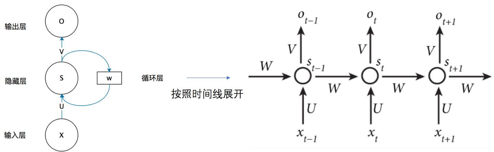
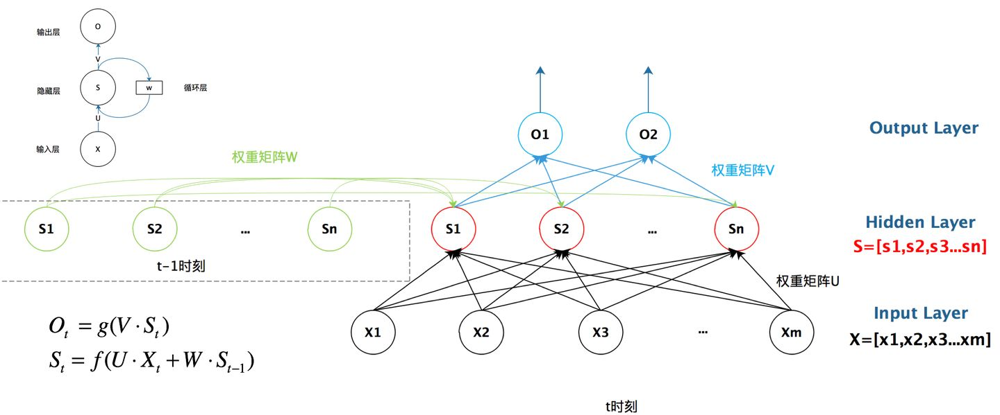

# CSCI 736 Neural Network

[toc]

# Paper Time Line

 Write 1 and 5

| Paper Content                                                | Time Schedule                                                |
| ------------------------------------------------------------ | ------------------------------------------------------------ |
|  |  |

## Paper Math Equation

$$
p_{end,j}=\dfrac{e^{z_{j}}}{\sum{j=n+1}^{2n} e^{z_{j}}} , j \in\{n+1, n+2, n+3 \ldots 2 n\}\\
\begin{aligned}

&input=[q_{1},q_{2},q_{3},\cdots, q_{N}],[d_{1}, d_{2}, d_{3}, \cdots,d_{M}], \text{(N,M : the number of tokens)}\\
&outputs=[index\ \ of\ \ max(p_{i}),index\ \ of\ \  max(p_{j}))]\\

&p_{start}=\frac{e^{z_i}}{\sum\limits_{i=1}^{n}e^{z_i}}, i \in \{1,2,3\cdots, M\}\\

&p_{end}=\frac{e^{z_{j}}}{\sum\limits_{j=1}^{n} e^{z_{j}}},\\ &j \in\{1, 2, 3 \ldots M\} \\
 
&loss=-log(p_{start,I})-log(p_{end,J})\\
&\text{the correct start and end position are }\\&
I \in\{1,2,3,4 \ldots \mathrm{n},J \in\{1,2,3,4 \ldots \mathrm{n}\}

\end{aligned}
$$

## Learning Resource

[李宏毅](https://www.bilibili.com/video/BV1JE411g7XF?from=search&seid=13732374700367344665)

# 文章理解

embedding(八种常用的embedding)->rnn->lstm&gru->attention->seq2seq->self-attention->transformer->bert

**embedding**

**RNN**

### **LSTM**

### **GRU**

### **attention**

参数少, 速度快, 效果好

[优质教程](https://shangzhih.github.io/jian-shu-attentionji-zhi.html)

### **Encoder&Decoder**

一类算法的统称

这类算法的统称:

1. 无论输入和输出的长度是什么, 中间的 向量c 长度固定
2. 根据不同任务可以选择不同的编码器和解码器

缺点: 当输入信息太长时，会丢失掉一些信息.

### **seq2seq $\in Encoder\&Deconder$**

一类算法的统称

这类算法的统称:	满足输入序列, 输出序列的目的

### **self-attention**

### **transformer**

### **bert**

linear classifier: two vector

each vector dot product the embedding, then apply softmax, find maximum to get index

### **Deep Auto-encoder**

Paper:[Deep  Auto-Encoder  Neural  Networks  in  Reinforcement  Learning](/Users/qyl/Library/Mobile Documents/com~apple~CloudDocs/NeuralNetwork-WorkSpace/Papers/Deep  Auto-Encoder  Neural  Networks  in  Reinforcement  Learning.pdf)

PPT:[Unsupervised Learning-Auto-encoder](/Users/qyl/Library/Mobile Documents/com~apple~CloudDocs/NeuralNetwork-WorkSpace/李宏毅PPT/Unsupervised Learning-Auto-encoder.pptx)

Stating from PCA

  

可以把PCA的前半部分视为encode, 后半部分decode

## Presentation

1. 自我介绍, 标题页

2. 第二页!!

   the thoughts of our algorithm is  that you input the question and document and it return subspan of the documents as the answer.

   Here is an example of the model

2. As we choose bert as baseline, we inputs tokens and bert return the answer's start and end index.

   So  let's assume that our question has n tokens and documents have m tokens, we inputs their concatenation into bert.

   

   最后一页!!!

   

   The bert will return vector $\C$ which has the same dismension as inputs but we only need the document part, because the answer is just the sub span of input document.

   

   As we need to find the start and end index, we prepare two linear classifiers

   We use them take dot product with $\C$'s document part and apply softmax to get p{start,i }and p{end,j} probabilty distribution

   

   Assume the correct start and end index named "I" and "J", then we could get the p_I from p_startdistri, p_J from p_end_j distri ,then the loss fucntion for this sample is 
   $$
   \text{should have correspond equation}
   $$
   Next, we apply backpropagation.

   we reapeat these processes until finish all training part.

   Beyond the basic QA system, our goal is to make it robust on unseen domain, to achieve such goal,we will try some existing strategies which will be discussed in related work and see if we can make any improvements.

CLS: the key word of the classifier

SEP: separate question tokens and document tokens

问题集